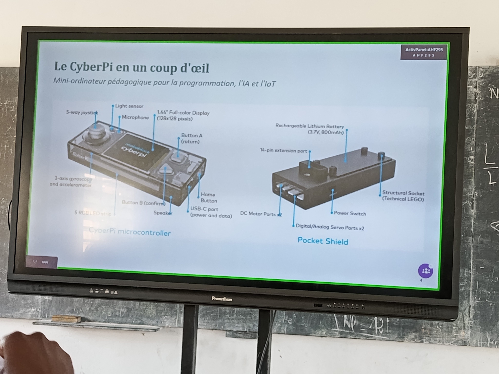
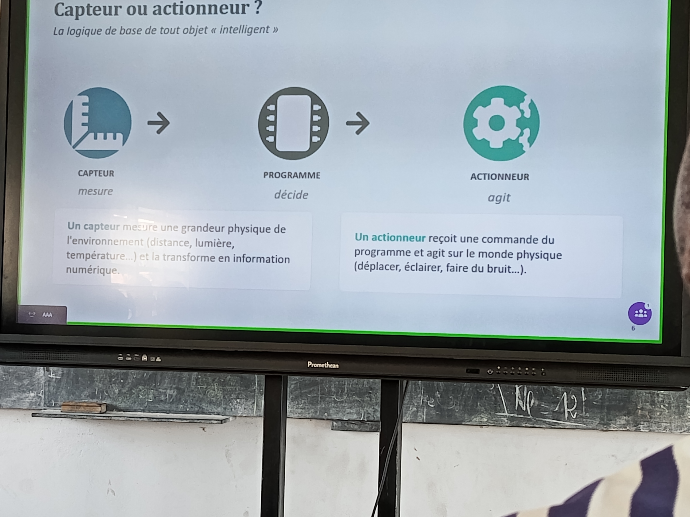
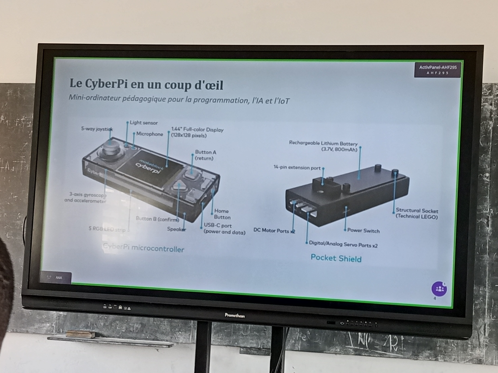
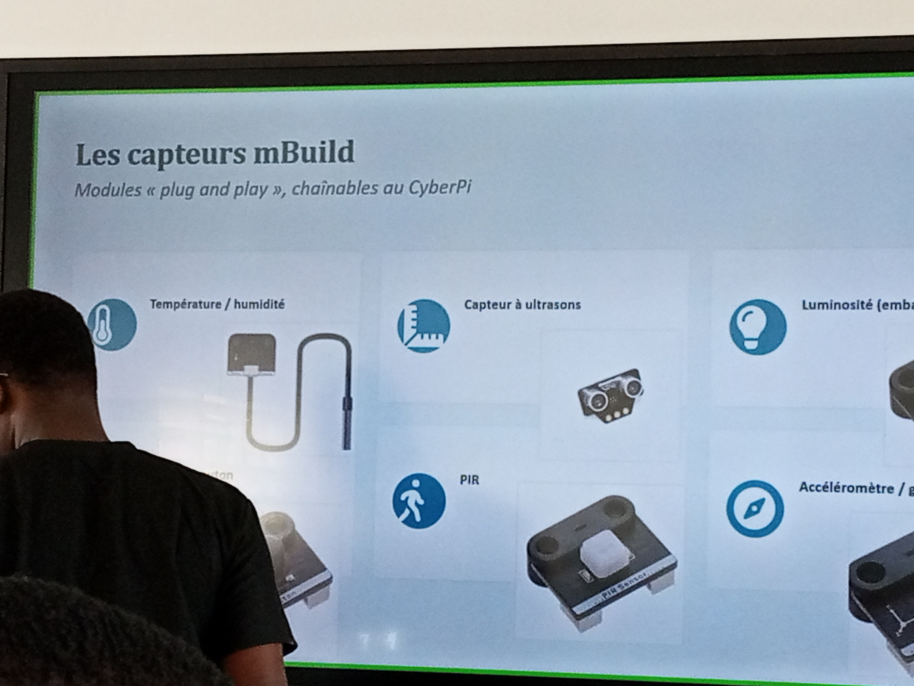
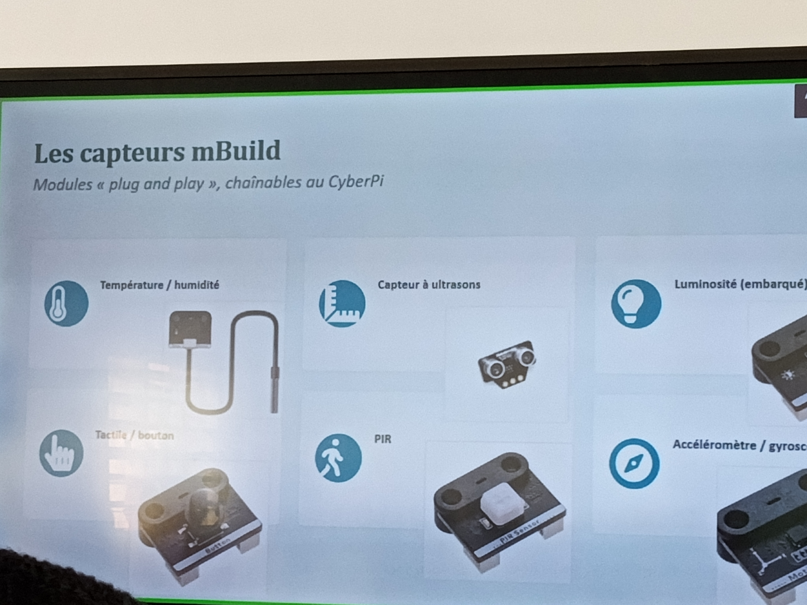
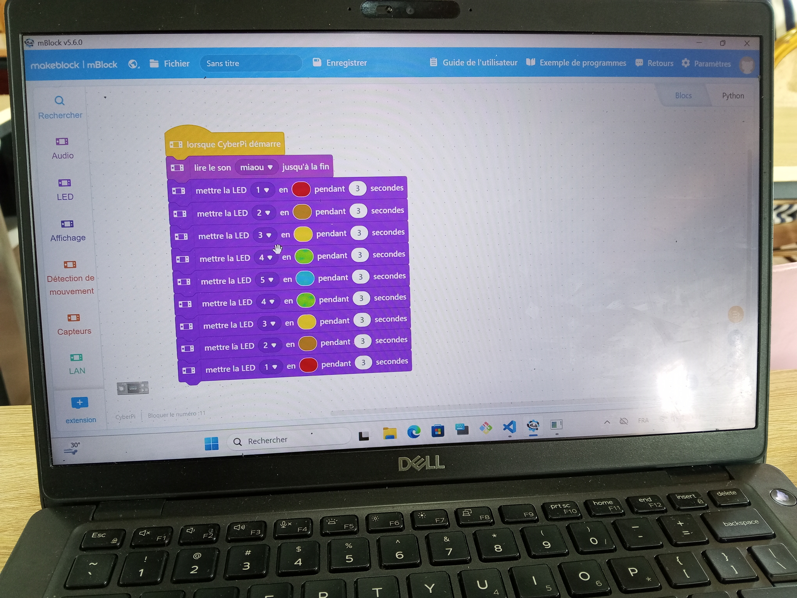
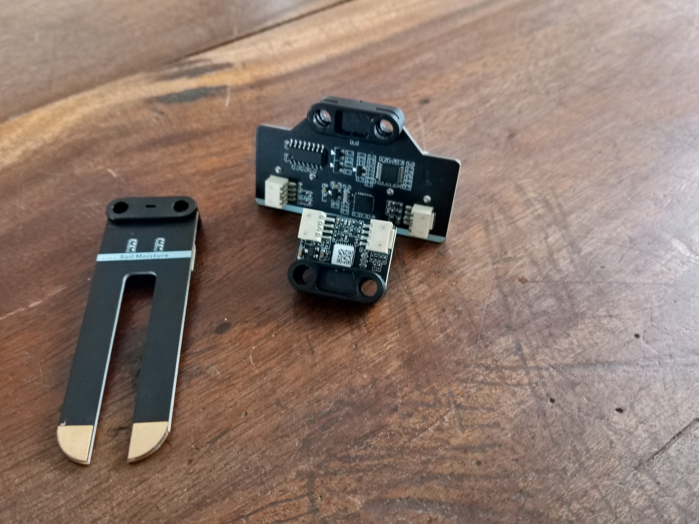
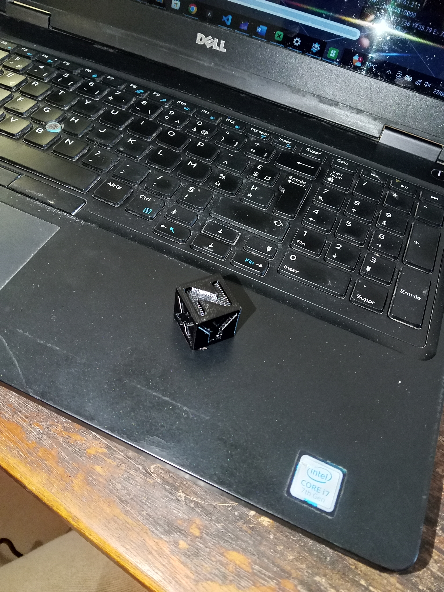
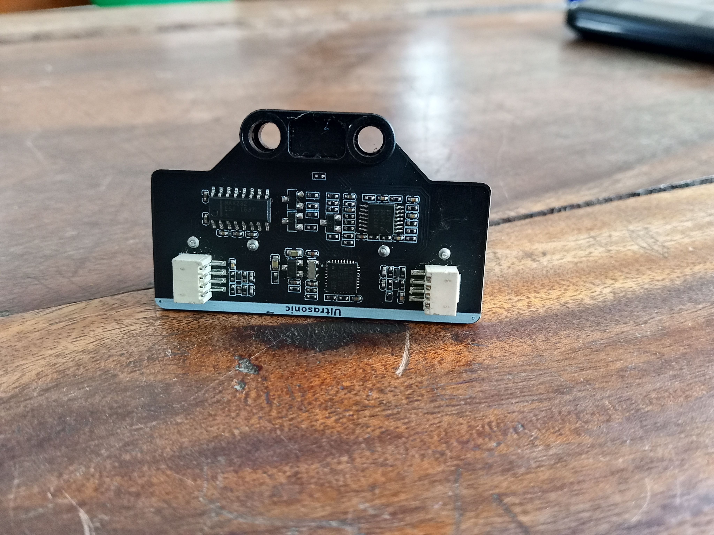
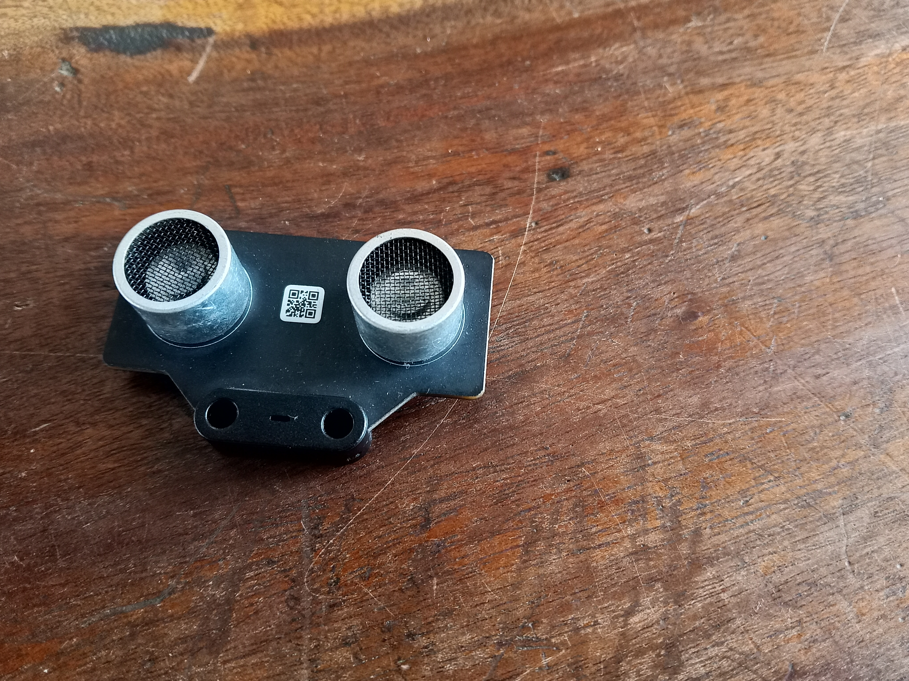

# Journal — mardi 27 août 2026 (rédigé par : Yawo Frederic BUAME )

## Fait aujourd'hui

- CyberPi& l'écosysème mBuild 
- Installation des logiciels tels que Mblock,Bambu Studio, PrusaSlicer 2.9.6 et Prusa G-code Viewer
- La programation avec ces logiciels a permi de voir les fonctionnalités des LED et l'impression en 3D des outils usuels 

## Appris

- commander avec les programmes ecrits avec CyberPi(LED)
- Création des objets avec Bambu Studio

## Raté, puis corrigé

- L'animation des LED avec CyberPi apres avoir programmé dans le logiciel au préalable suivant une seconde d'animation du premier LED jusqu'au dernier 
- Apres avoir été assisté par le formateur j'ai pu corriger ce manquement

## Décidé

- A l'issue de tout ce que nous avons fait , j'ai pris la résolution de ne plus manquer ces petits details

## À faire demain

- [Action] — Prénom
- [Action] — Prénom
